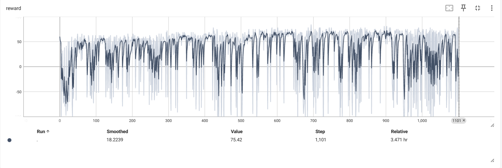
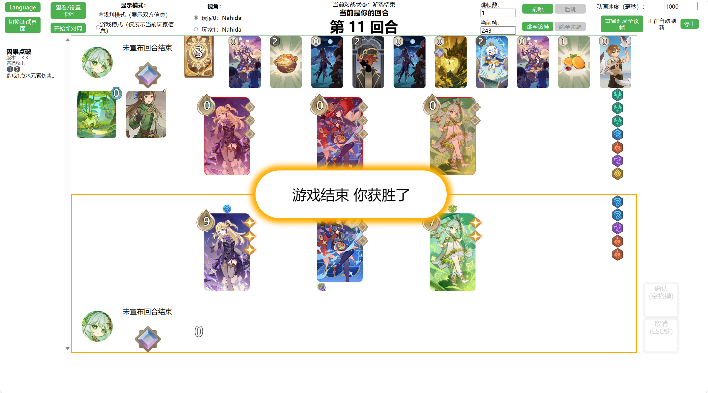

# Genius Invokation TCG - Reinforce Learning（GeniusInvokation-RL）七圣召唤强化学习

该项目基于水皇模拟器的后端[LPSim/backend](https://github.com/LPSim/backend)，使用Python 3.10编写，使用Pytorch。遵守AGPL-3.0协议。


## 项目进度

定义了简陋的状态空间（极不完整），基本复用LPSim的动作空间（目前的实现在RLAgent.py）（经测试发现不完整），定义了简单的奖励。

参考LPSim的非交互对局代码，移植了课程实验的DQN和DuelingDDQN代码，以LPSim的RandomAgent为对手，能进行给定构筑（Deck）的单个对局训练。

效果只能说学会了初始骰子好的时候使用卡牌和技能。


## 使用方法

该项目需要Python 3.10或更新版本。

### 安装LPSim

请参看[LPSim/backend](https://github.com/LPSim/backend)，进行安装。

### 安装Pytorch等

推荐使用conda

```
conda install pytorch==1.12.1 torchvision==0.13.1 torchaudio==0.12.1 cudatoolkit=11.6 -c pytorch -c conda-forge
pip install tensorboard
```

### 查看训练后的reward曲线图像

```powershell
tensorboard --logdir=log目录（例如log\dqn）
```

即可

按指示操作在浏览器中查看

### 使用LPSim前端查看策略

修改

```
MODEL_PATH = 'log/lpsim/DuelingDDQN/ckpt/112000.pth' # 要查看的策略（网络）文件目录
TEST = True # 默认False进行训练
```

然后待进行一个对局后唤起本地服务器，即可打开LPSim前端查看这一对局


## TO-DO List

[] 扩展状态空间（主要是不能直接用，需要转化成float list）

[] 修改动作空间（经测试发现每个player的动作似乎只会在回合开始后第一次行动前计算，应该需要每次行动前都重新计算，此外每个行动的细节空间也未处理）

[] 完善奖励

[] 实现MinMax的零和博弈版本，进行自对弈训练（因为之前没写过，所以暂时还不会）

[] （远期目标）实现MCTS的全构筑训练版本


## 当前成果

DQN训练200局，30-60min

DuelingDQN训练1101局，约3.5h

```
EACH_STEP_REWARD = -0.01
EACH_ROUND_REWARD = -3
WIN_REWARD = 100
```





学会了使用手牌、技能（但得初始骰子好）、调和骰子（无意义），发现了动作空间存在问题.

至少不是只会普通攻击和变成投降派（第7个回合后就开始宣布回合结束）